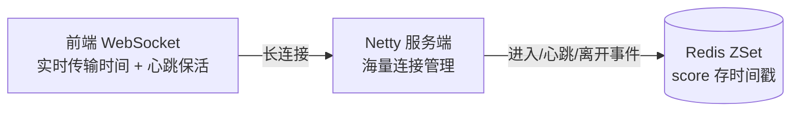

# 高并发设计

## 秒杀系统如何设计？

### 总体架构

### 分层设计

#### 前端：挡住无意义请求

- 静态资源全上 CDN，页面静态化
- 按钮置灰 + 点击后倒计时，防止重复提交
- 答题/验证码：削峰 + 防机器人

#### 网关层：限流 + 防刷

- 网关限流（令牌桶），超出容量的请求直接拒绝返回"已抢完"
- 黑名单、风控：识别机器流量、同一用户/IP 高频请求
- 同一用户维度：uid + 商品 维度去重（Redis setnx）

#### 应用层：Redis 预扣库存（核心）

- 库存预热：活动前把库存加载到 Redis

- 原子执行：使用Lua 脚本在redis中原子执行扣除

#### 支撑层：削掉 DB 峰值

- DB 只承受 ≈ 库存量的写入，且被 MQ 拉平
- 下单失败（极端并发下库存不够）：消息进补偿流程，通知用户失败

#### 数据层：兜底防超卖

## 如何统计直播间观众停留时长？

::: info

若 ZSet 单 key 过大，可按时间等指标分片，避免大 key 阻塞。
:::

## 限流算法有哪些？

| 算法 | 优点 | 缺点 |
|------|------|------|
| **固定窗口** | 实现最简单 | **临界突刺**：窗口交界处两倍流量可通过 |
| **滑动窗口** | 平滑临界问题 | 格越细内存/CPU 越高 |
| **漏桶** | 出口绝对平滑 | 无法应对突发（再突发也只能匀速） |
| **令牌桶** | 允许短时突发（攒的令牌可用） | 实现稍复杂 |
| **滑动日志** | 最精确 | 存储大（Redis zset 每请求一条） |

### 各算法描述

- **固定窗口计数**：设 1 分钟最多 100 次，每次请求计数 +1，超限拒绝，窗口结束清零。临界问题：第 59 秒和下一分钟第 1 秒各放 100 次，实际 2 秒内 200 次
- **滑动窗口计数**：把 1 分钟切成多个小格（如 6 个 10 秒格），每次请求统计"当前时间往前 60 秒"覆盖的小格总和，窗口随时间滑动，消除交界突刺。**Sentinel 采用**。
- **漏桶**：请求像水滴进桶，以恒定速率流出处理，桶满则溢出拒绝——不管进来多猛，出口永远匀速
- **令牌桶**：系统匀速往桶里放令牌，请求先取令牌再处理；桶内有存量时允许一波突发通过，平均速率仍受控。**Redis 采用**。
- **滑动日志**：为每个请求记时间戳（Redis ZSet 实现），请求时统计窗口内的条数是否超限；精确到每个请求，存储随 QPS 增长

## 分布式锁有哪些实现方式？

| 实现 | 核心原理 | 优点 | 缺点 |
|------|----------|------|------|
| **数据库** | 唯一索引插入成功即获锁；或 `select for update` 行锁 | 简单，无额外中间件 | 性能差；无过期自动释放（要自己清理）；不支持可重入 |
| **Redis** | `SET key uuid NX EX 10` 加锁，Lua 脚本校验 uuid 后 DEL 释放 | 性能最高（AP） | 锁过期但业务没执行完 → 需**看门狗续期**（Redisson）；主从切换可能丢锁 |
| **Redisson** | Redis 的封装：可重入（hash 结构计数）、看门狗自动续期、Lua 原子解锁 | 生产首选，API 简单 | 依赖 Redis 可用性 |
| **ZooKeeper** | 创建**临时顺序节点**，最小的获锁，watch 前驱节点释放后唤醒 | 临时节点会话断开自动释放，无死锁；公平（CP） | 性能一般；ZK 集群维护成本高（Curator InterProcessMutex 封装） |
| **Consul** | KV 存储 + Session/TTL（会话失效锁自动释放）+ CAS | 强一致（Raft）；自带服务发现 | 需引入 Consul 集群 |
