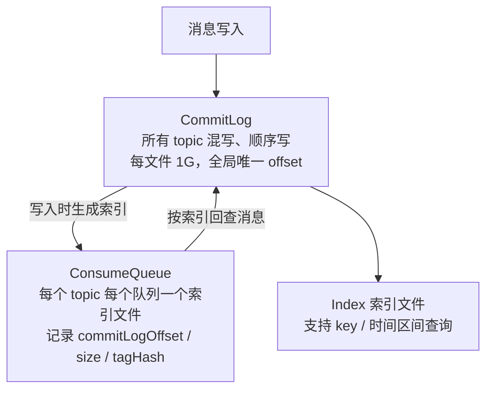

# 架构

## RocketMQ 的架构是怎样的？

四大组件：**NameServer、Broker、Producer、Consumer**。

### 整体架构

### 四大组件职责

| 组件 | 职责 | 特点 |
|------|------|------|
| **NameServer** | 路由注册与发现：记录 topic → Broker 的映射 | 无状态、节点间**不通信**；挂一半不影响；Broker 每 30s 注册，120s 未心跳剔除 |
| **Broker** | 消息存储、投递；主从同步 | Master 读写、Slave 备份 |
| **Producer** | 发消息，与 NameServer/Broker 建长连接 | 客户端负载均衡选队列；发送重试 |
| **Consumer** | 拉取并消费消息 | **pull 长轮询**伪装 push；组内队列分摊 |

### 存储结构

**为什么所有消息混写一个 CommitLog？**
- 磁盘**顺序写**是性能关键：多个 topic 各写各的会退化为随机 IO

- 代价：消费时要回查 CommitLog（ConsumeQueue 是稠密索引，开销可控）

  

### 消息流转全流程

1. Broker 启动 → 向所有 NameServer 注册路由
2. Producer 发消息前 → 任选一个 NameServer 拉路由（本地缓存 30s 更新）
3. Producer 按负载均衡选一个 MessageQueue → 发给对应 Broker Master
4. Broker 写 CommitLog → 生成 ConsumeQueue 索引 →（同步/异步）刷盘
  5.（主从架构）Slave 同步/复制 Master 数据
5. Consumer 拉路由 → 按队列负载均衡 → 向 Broker 发长轮询请求拉消息
6. Broker 收到新消息后响应挂起的拉取请求 → 消费 → 返回 ACK
   消费失败 → 重试队列 %RETRY% → 达到次数进死信队列 %DLQ%

### 与 Kafka 架构对比

| 对比 | RocketMQ | Kafka |
|------|----------|-------|
| 路由中心 | NameServer（无状态，AP） | ZooKeeper/KRaft（CP） |
| 存储 | 单 CommitLog 顺序写 + 队列索引 | 每个 Partition 独立日志段 |
| 队列数 | 支持上万队列 | 队列多时性能下降明显 |
| 延迟消息 | 原生支持（18 个级别） | 不支持 |
| 事务消息 | 支持（半消息 + 回查） | 不支持 |
| 适用 | 业务消息（订单、交易） | 日志流处理、大吞吐 |
