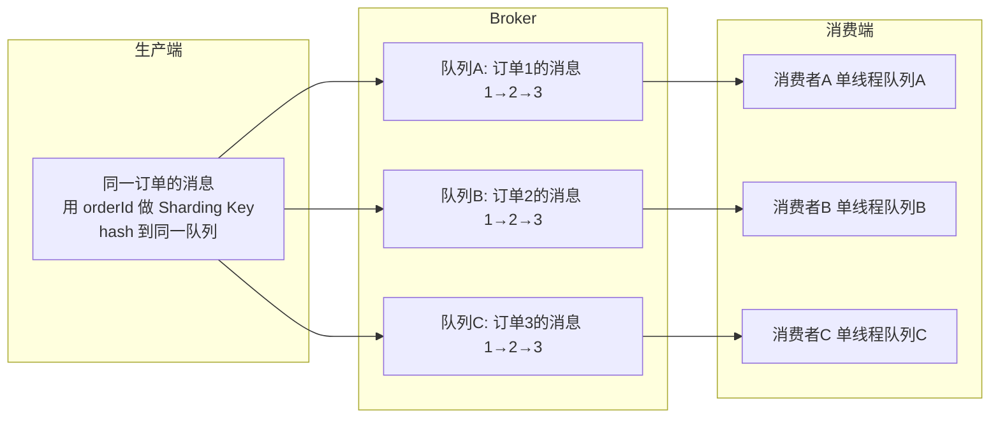
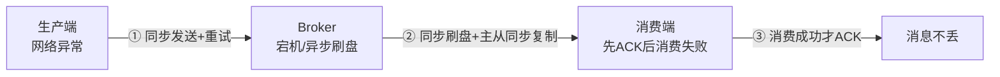

# 可靠性

## RocketMQ 如何确保消息不重复消费？

### 重复无法完全避免

RocketMQ 投递语义是 **At Least Once（至少一次）**——宁可重复，不可丢失。重复的来源。**RocketMQ 只保证不丢，不保证不重；幂等必须由消费端自己做**。

### 消费端幂等方案

#### 1. 数据库唯一索引（最可靠）

以业务唯一键（订单号、流水号）建唯一索引，重复消费插入直接失败，天然幂等。

#### 2. 去重表 / Redis 标记

使用 setnx 命令

## RocketMQ 如何确保消息顺序消费？

### 两端配合：局部有序方案

RocketMQ 的顺序是**局部有序**（同一 Sharding Key 内有序），不是全局有序：

#### 生产端

使用 `MessageQueueSelector` ，保证消息hash到同一队列

#### 消费端

使用 `MessageListenerOrderly` ，保证同一队列内串行消费

**要点**：MQ默认是并发消费

### 全局有序（很少用）

单 topic 单队列 + 单消费者 → 全局有序，但吞吐退化为单线程，一般不采用；真需要全局有序时先怀疑设计。

。

## RocketMQ 如何解决消息丢失的问题？

消息可能在**生产发送、Broker 存储、消费确认**三个环节丢失，逐环节加固。

### 生产端

三种发送方式：

| 方式 | 是否等结果 | 可靠性 | 适用 |
|------|-----------|--------|------|
| **同步发送** | 等 Broker 确认 | 高，失败可重试（默认 2 次） | 可靠性消息 |
| 异步发送 | 回调拿结果 | 中，回调里可补救 | 链路耗时敏感 |
| oneway | 发完即忘 | 最低，不等不重试 | 日志、 metrics |

不丢的做法：同步发送 + 失败重试 + 发送状态非 OK 时兜底

###  Broker

两个关键配置：

| 配置 | 选项 | 说明 |
|------|------|------|
| 刷盘 | `SYNC_FLUSH` / `ASYNC_FLUSH`（默认） | 同步：落盘才返回；异步：写内存即返回，断电丢 |
| 复制 | `SYNC_MASTER` / `ASYNC_MASTER` | 同步：Slave 写成功才返回；异步：主坏未复制部分丢 |

不丢的组合：同步刷盘 + 同步复制

### 消费端

- 原则：**先执行业务，成功后才返回 CONSUME_SUCCESS**
- 失败返回 RECONSUME_LATER → 进重试队列重投
- 超过重试次数进**死信队列 %DLQ%**，监控告警 + 人工处理
